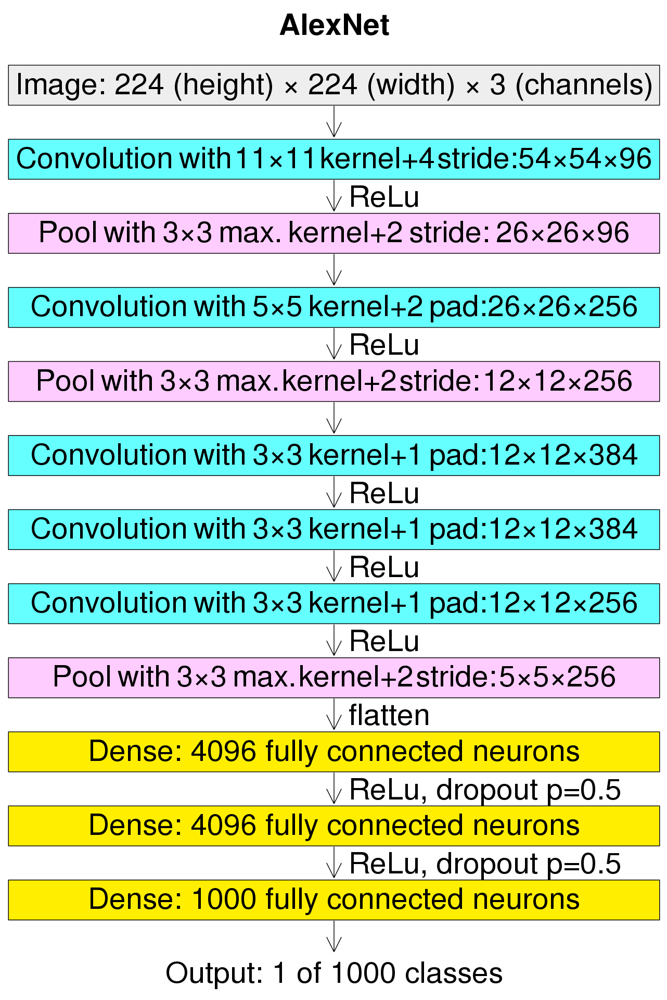
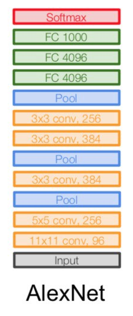

# AlexNet 网络模型介绍

## 介绍

随着技术的进步和发展，计算机的算力越来越强大，尤其是在GPU并行计算能力的推动下，复杂神经网络的计算也变得更加容易实施。另一方面，互联网上涌现出越来越多的数据，极大的丰富了数据库。同时也有越来越多的研究人员开始专门针对神经网络做算法和模型的优化，Alex Krizhevsky等人提出的AlexNet以很大优势获得了2012年ImageNet比赛的冠军。这一成果极大的激发了产业界对神经网络的兴趣，开创了使用深度神经网络解决图像问题的途径，随后也在这一领域涌现出越来越多的优秀成果。

## 特点

AlexNet与LeNet相比，具有更深的网络结构，包含5层卷积和3层全连接，同时使用了如下三种方法改进模型的训练过程：

- 数据增广：深度学习中常用的一种处理方式，通过对训练随机加一些变化，比如平移、缩放、裁剪、旋转、翻转或者增减亮度等，产生一系列跟原始图片相似但又不完全相同的样本，从而扩大训练数据集。通过这种方式，可以随机改变训练样本，避免模型过度依赖于某些属性，能从一定程度上抑制过拟合。
- 使用Dropout抑制过拟合。
- 使用ReLU激活函数减少梯度消失现象。

## 结构




- AlexNet 图像大小应该是 227x227x3，而不是 224x224x3，所以数学会正确。原始论文说不同的数字，但特斯拉计算机视觉负责人 Andrej Karpathy 说应该是 227x227x3（他说 Alex 没有描述他为什么放224x224x3）。下一个卷积应该是11x11，步幅为4：55x55x96（而不是54x54x96）。它可以计算为，例如：[（输入宽度227 - 内核宽度11）/步幅4] + 1 = [(227 - 11) / 4] + 1 = 55。由于内核输出的长度与宽度相同，因此其面积为 55x55。

## 示例代码

- 飞桨示例代码

```python
import paddle
import paddle.nn as nn
import paddle.nn.functional as F


# AlexNet 网络模型
class AlexNet(nn.Layer):
    """
    AlexNet 网络模型

    输入图像大小为 224 x 224
    池化层 kernel_size = 2, 第一层卷积层填充 paddling = 2
    """
    def __init__(self, num_classes=10, pool_kernel_size=2, conv1_paddling=2, fc1_in_features=9216):
        """
        AlexNet 网络模型

        Args:
            num_classes (int, optional): 分类数量, 默认 10
            pool_kernel_size (int, optional): 池化层核大小, 默认 2
            conv1_paddling (int, optional): 第一层卷积层填充, 默认 2,
                输入图像大小为 224 x 224 填充 2
            fc1_in_features (int, optional): 第一层全连接层输入特征数量, 默认 9216, 
                根据 max_pool3 输出结果, 计算得出 256*6*6 = 9216

        Raises:
            Exception: 分类数量 num_classes 必须大于等于 2
        """        
        super(AlexNet, self).__init__()
        if num_classes < 2:
            raise Exception("分类数量 num_classes 必须大于等于 2: {}".format(num_classes))
        self.num_classes = num_classes
        self.pool_kernel_size = pool_kernel_size
        self.fc1_in_features = fc1_in_features
        self.conv1 = nn.Conv2D(
            in_channels=3, out_channels=96, kernel_size=11, stride=4, padding=conv1_paddling)
        self.max_pool1 = nn.MaxPool2D(kernel_size=pool_kernel_size, stride=2)
        self.conv2 = nn.Conv2D(
            in_channels=96, out_channels=256, kernel_size=5, stride=1, padding=2)
        self.max_pool2 = nn.MaxPool2D(kernel_size=pool_kernel_size, stride=2)
        self.conv3 = nn.Conv2D(
            in_channels=256, out_channels=384, kernel_size=3, stride=1, padding=1)
        self.conv4 = nn.Conv2D(
            in_channels=384, out_channels=384, kernel_size=3, stride=1, padding=1)
        self.conv5 = nn.Conv2D(
            in_channels=384, out_channels=256, kernel_size=3, stride=1, padding=1)
        self.max_pool3 = nn.MaxPool2D(kernel_size=pool_kernel_size, stride=2)
        # in_features 9216 = max_pool3 输出 256*6*6
        self.fc1 = nn.Linear(in_features=fc1_in_features, out_features=4096)
        self.drop_ratio1 = 0.5
        self.drop1 = nn.Dropout(self.drop_ratio1)
        self.fc2 = nn.Linear(in_features=4096, out_features=4096)
        self.drop_ratio2 = 0.5
        self.drop2 = nn.Dropout(self.drop_ratio2)
        self.fc3 = nn.Linear(in_features=4096, out_features=num_classes)

    def forward(self, x):
        x = self.conv1(x)
        x = F.relu(x)
        x = self.max_pool1(x)
        x = self.conv2(x)
        x = F.relu(x)
        x = self.max_pool2(x)
        x = self.conv3(x)
        x = F.relu(x)
        x = self.conv4(x)
        x = F.relu(x)
        x = self.conv5(x)
        x = F.relu(x)
        x = self.max_pool3(x)
        # flatten 根据给定的 start_axis 和 stop_axis 将连续的维度展平
        x = paddle.flatten(x, start_axis=1, stop_axis=-1)
        x = self.fc1(x)
        x = F.relu(x)
        # 在全连接之后使用 dropout 抑制过拟合
        x = self.drop1(x)
        x = self.fc2(x)
        x = F.relu(x)
        # 在全连接之后使用 dropout 抑制过拟合
        x = self.drop2(x)
        x = self.fc3(x)
        return x
```
