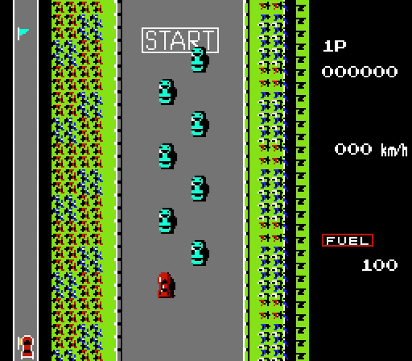

# 小熊飞桨练习册-07PaddleX寻找火箭车车

## 简介

小熊飞桨练习册-07PaddleX寻找火箭车车，是学习目标检测小项目，本项目开发和测试均在 Ubuntu 20.04 系统下进行。  
项目最新代码查看主页：[小熊飞桨练习册](https://gitee.com/cnhemiya/paddle-workbook)  
百度飞桨 AI Studio 主页：[小熊飞桨练习册-07PaddleX寻找火箭车车](https://aistudio.baidu.com/aistudio/projectdetail/4078239)  
Ubuntu 系统安装 CUDA 参考：[Ubuntu 百度飞桨和 CUDA 的安装](https://my.oschina.net/hemiya/blog/5509991)

- FC游戏火箭车，游戏演示



## 文件说明

|文件|说明|
|--|--|
|train.py|训练程序|
|prune.py|裁剪程序|
|quant.py|量化程序|
|infer.py|预测程序|
|onekey.sh|一键获取数据到 dataset 目录下|
|onetasks.sh|一键训练，量化脚本|
|get_data.sh|获取数据到 dataset 目录下|
|check_data.sh|检查 dataset 目录下的数据是否存在|
|mod/args.py|命令行参数解析|
|mod/pdxconfig.py|PaddleX 配置|
|mod/config.py|配置|
|mod/utils.py|杂项|
|mod/report.py|结果报表|
|dataset|数据集目录|
|doc|文档目录|
|output|训练参数保存目录|
|result|预测结果保存目录|

## 环境依赖

- [百度飞桨](https://www.paddlepaddle.org.cn/)
- [PaddleX](https://gitee.com/paddlepaddle/PaddleX)
- **AI Studio** 环境，右侧 **包管理** 手动安装 **PaddleX**

## 数据集

数据集来源于自己收集标注的百度飞桨公共数据集：[寻找火箭车车](https://aistudio.baidu.com/aistudio/datasetdetail/148354)

数据集包含训练集，验证集，测试集，相应的 VOC 格式标注文件。 

### 如何自己标注数据

- 使用标注工具：[labelImg](https://github.com/tzutalin/labelImg)
- 中文界面，支持 VOC 格式，COCO 格式
- 打开图像目录
- W 是标注
- D 是下一张
- A 是上一张

- labelImg 演示


## 一键获取数据

- 运行脚本，包含以下步骤：获取数据，生成图像路径和标签的文本文件，检查数据。
- 详情查看 **onekey.sh**

如果运行在本地计算机，下载完数据，文件放到 **dataset** 目录下，在项目目录下运行下面脚本。

如果运行在百度 **AI Studio** 环境，查看 **data** 目录是否有数据，在项目目录下运行下面脚本。

```bash
bash onekey.sh
```

## 配置模块

可以查看修改 **mod/pdxconfig.py** 文件，有详细的说明

## 开始训练

运行 **train.py** 文件，查看命令行参数加 -h

- 示例

```bash
python3 run/train.py \
    --dataset ./dataset/road_fighter_car \
    --epochs 32 \
    --batch_size 1 \
    --learning_rate 0.01 \
    --model PicoDet \
    --backbone MobileNetV3 \
    --save_interval_epochs 4 \
    --pretrain_weights "" \
    --save_dir ./output
```

- 参数

```bash
  -h, --help            show this help message and exit
  --cpu                 是否使用 cpu 计算，默认使用 CUDA
  --num_workers         线程数量，默认 auto，为CPU核数的一半
  --epochs              训练几轮，默认 4 轮
  --batch_size          一批次数量，默认 16
  --learning_rate       学习率，默认 0.025
  --warmup_steps        默认优化器的warmup步数，学习率将在设定的步数内，从warmup_start_lr线性增长至设定的learning_rate
                        ，默认为0。
  --warmup_start_lr     默认优化器的warmup起始学习率，默认为0.0。
  --lr_decay_epochs     默认优化器的学习率衰减轮数。默认为 30 60 90
  --lr_decay_gamma      默认优化器的学习率衰减率。默认为0.1
  --save_interval_epochs 
                        模型保存间隔(单位: 迭代轮数)。默认为1
  --save_dir            模型保存路径。默认为 ./output/
  --dataset             数据集目录，默认 ./dataset/
  --resume_checkpoint   恢复训练时指定上次训练保存的模型路径, 默认不会恢复训练
  --train_list          训练集列表，默认 '--dataset' 参数目录下的 train_list.txt
  --eval_list           评估集列表，默认 '--dataset' 参数目录下的 val_list.txt
  --label_list          分类标签列表，默认 '--dataset' 参数目录下的 labels.txt
  --pretrain_weights    若指定为'.pdparams'文件时，从文件加载模型权重；若为字符串’IMAGENET’，则自动下载在ImageNet图片数据上
                        预训练的模型权重；若为字符串’COCO’，则自动下载在COCO数据集上预训练的模型权重；若为None，则不使用预训练模型。默认为
                        'IMAGENET'。
  --model               PaddleX 模型名称
  --model_list          输出 PaddleX 模型名称，默认不输出，选择后只输出信息，不会开启训练
  --backbone            目标检测模型的 backbone 网络
```

## 查看支持的模型

- 运行命令

```bash
python3 run/train.py --model_list
```

- 结果

```bash
PaddleX 目标检测模型
['PPYOLOv2', 'PPYOLO', 'PPYOLOTiny', 'PicoDet', 'YOLOv3', 'FasterRCNN']
PPYOLOv2 backbone 网络
['ResNet50_vd_dcn', 'ResNet101_vd_dcn']
PPYOLO backbone 网络
['ResNet50_vd_dcn', 'ResNet18_vd', 'MobileNetV3_large', 'MobileNetV3_small']
PPYOLOTiny backbone 网络
['MobileNetV3']
PicoDet backbone 网络
['ESNet_s', 'ESNet_m', 'ESNet_l', 'LCNet', 'MobileNetV3', 'ResNet18_vd']
YOLOv3 backbone 网络
['MobileNetV1', 'MobileNetV1_ssld', 'MobileNetV3', 'MobileNetV3_ssld', 'DarkNet53', 'ResNet50_vd_dcn', 'ResNet34']
FasterRCNN backbone 网络
['ResNet50', 'ResNet50_vd', 'ResNet50_vd_ssld', 'ResNet34', 'ResNet34_vd', 'ResNet101', 'ResNet101_vd', 'HRNet_W18']
```

## 模型裁剪

- 运行 **prune.py** 文件，查看命令行参数加 -h。
- 注意：有的模型不支持裁剪。
- 参数 --pretrain_weights 必须为空 ""，裁剪后的精度大部分会降低。
- 参考文档：[模型裁剪](https://gitee.com/paddlepaddle/PaddleX/tree/develop/tutorials/slim/prune)
- 示例

```bash
python3 run/prune.py \
    --dataset ./dataset/road_fighter_car \
    --epochs 32 \
    --batch_size 1 --learning_rate 0.001 \
    --save_interval_epochs 4 \
    --model_dir ./output/best_model \
    --save_dir ./output/prune \
    --pruned_flops 0.2 \
    --pretrain_weights ""
```

- 参数

```bash
  -h, --help            show this help message and exit
  --cpu                 是否使用 cpu 计算，默认使用 CUDA
  --num_workers         线程数量，默认 auto，为CPU核数的一半
  --epochs              训练几轮，默认 4 轮
  --batch_size          一批次数量，默认 16
  --learning_rate       学习率，默认 0.025
  --warmup_steps        默认优化器的warmup步数，学习率将在设定的步数内，从warmup_start_lr线性增长至设定的learning_rate
                        ，默认为0。
  --warmup_start_lr     默认优化器的warmup起始学习率，默认为0.0。
  --lr_decay_epochs     默认优化器的学习率衰减轮数。默认为 30 60 90
  --lr_decay_gamma      默认优化器的学习率衰减率。默认为0.1
  --save_interval_epochs 
                        模型保存间隔(单位: 迭代轮数)。默认为1
  --save_dir            模型保存路径。默认为 ./output/
  --dataset             数据集目录，默认 ./dataset/
  --resume_checkpoint   恢复训练时指定上次训练保存的模型路径, 默认不会恢复训练
  --train_list          训练集列表，默认 '--dataset' 参数目录下的 train_list.txt
  --eval_list           评估集列表，默认 '--dataset' 参数目录下的 val_list.txt
  --label_list          分类标签列表，默认 '--dataset' 参数目录下的 labels.txt
  --model_dir           模型读取路径。默认为 ./output/best_model
  --skip_analyze        是否跳过分析模型各层参数在不同的裁剪比例下的敏感度，默认不跳过
  --pruned_flops        根据选择的FLOPs减小比例对模型进行裁剪。默认为 0.2
```

## 模型量化

- 运行 **quant.py** 文件，查看命令行参数加 -h
- model_dir 是正常训练后的模型保存目录。
- 参考文档：[模型量化](https://gitee.com/paddlepaddle/PaddleX/tree/develop/tutorials/slim/quantize)
- 示例

```bash
python3 run/quant.py \
    --dataset ./dataset/road_fighter_car \
    --epochs 32 \
    --batch_size 1 \
    --learning_rate 0.001 \
    --save_interval_epochs 4 \
    --model_dir ./output/best_model \
    --save_dir ./output/quant
```

- 参数

```bash
  -h, --help            show this help message and exit
  --cpu                 是否使用 cpu 计算，默认使用 CUDA
  --num_workers         线程数量，默认 auto，为CPU核数的一半
  --epochs              训练几轮，默认 4 轮
  --batch_size          一批次数量，默认 16
  --learning_rate       学习率，默认 0.025
  --warmup_steps        默认优化器的warmup步数，学习率将在设定的步数内，从warmup_start_lr线性增长至设定的learning_rate
                        ，默认为0。
  --warmup_start_lr     默认优化器的warmup起始学习率，默认为0.0。
  --lr_decay_epochs     默认优化器的学习率衰减轮数。默认为 30 60 90
  --lr_decay_gamma      默认优化器的学习率衰减率。默认为0.1
  --save_interval_epochs 
                        模型保存间隔(单位: 迭代轮数)。默认为1
  --save_dir            模型保存路径。默认为 ./output/
  --dataset             数据集目录，默认 ./dataset/
  --resume_checkpoint   恢复训练时指定上次训练保存的模型路径, 默认不会恢复训练
  --train_list          训练集列表，默认 '--dataset' 参数目录下的 train_list.txt
  --eval_list           评估集列表，默认 '--dataset' 参数目录下的 val_list.txt
  --label_list          分类标签列表，默认 '--dataset' 参数目录下的 labels.txt
  --model_dir           模型读取路径。默认为 ./output/best_model
```

## 预测模型

- 运行 **infer.py** 文件，查看命令行参数加 -h
- show_result 本地计算机运行有效
- 示例

```bash
python3 run/infer.py --model_dir ./output/best_model \
    --predict_image ./dataset/road_fighter_car/JPEGImages/0297.jpg
```

- 参数

```bash
  -h, --help        show this help message and exit
  --model_dir       读取模型的目录，默认 './output/best_model'
  --predict_image   预测的图像文件
  --threshold       score阈值，将Box置信度低于该阈值的框过滤，默认 0.5
  --result_list     预测的结果列表文件，默认 './result/result.txt'
  --result_dir      预测结果可视化的保存目录，默认 './result'
  --show_result     显示预测结果的图像
```

- 结果演示


## 部署模型导出

- --fixed_input_shape 来指定输入大小[w,h]或者是[n,c,w,h]
- 参考文档：[部署模型导出](https://gitee.com/paddlepaddle/PaddleX/blob/develop/docs/apis/export_model.md)
- 示例

```bash
paddlex --export_inference --model_dir=./output/best_model/ --save_dir=./output/inference_model --fixed_input_shape=[-1,3,608,608]
```

## VisualDL 可视化分析工具

- 安装和使用说明参考：[VisualDL](https://gitee.com/paddlepaddle/VisualDL)
- 如果是 **AI Studio** 环境训练的把 **output/vdl_log** 目录下载下来，解压缩后放到本地项目目录下 **output/vdl_log** 目录
- 在项目目录下运行下面命令
- 然后根据提示的网址，打开浏览器访问提示的网址即可

```bash
visualdl --logdir ./output/vdl_log
```
