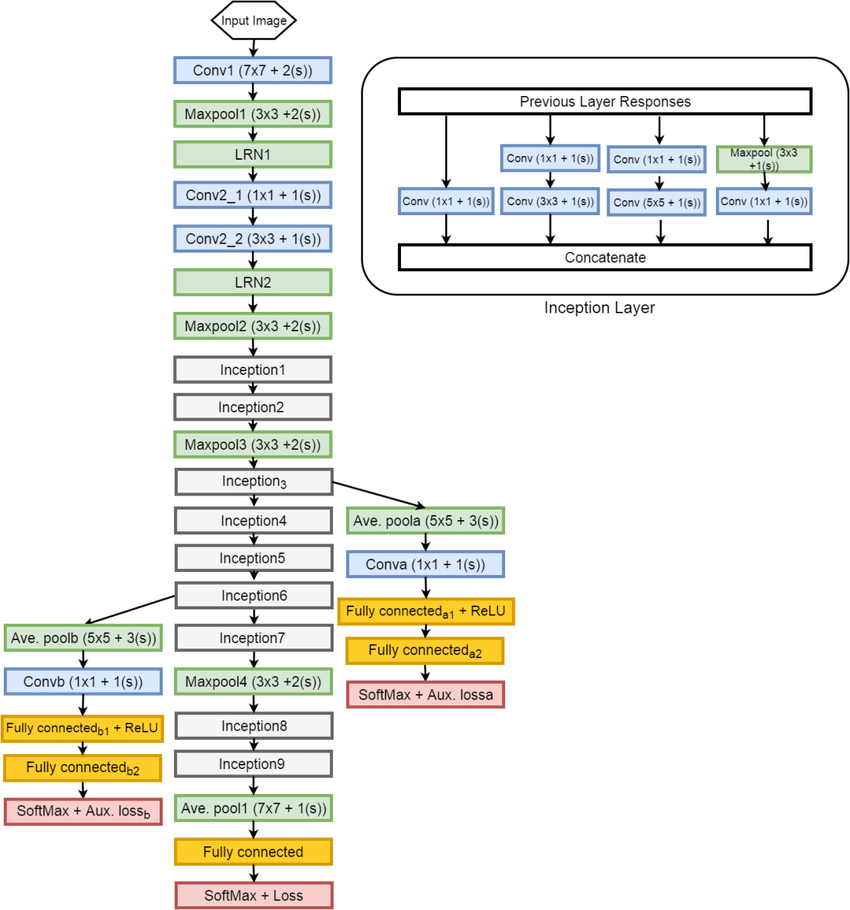

# GoogLeNet 网络模型介绍

## 介绍

GoogLeNet是2014年ImageNet比赛的冠军，它的主要特点是网络不仅有深度，还在横向上具有“宽度”。由于图像信息在空间尺寸上的巨大差异，如何选择合适的卷积核来提取特征就显得比较困难了。空间分布范围更广的图像信息适合用较大的卷积核来提取其特征；而空间分布范围较小的图像信息则适合用较小的卷积核来提取其特征。为了解决这个问题，GoogLeNet提出了一种被称为Inception模块的方案。

## 特点

GoogLeNet最基本的网络块是Inception，它是一个并联网络块，经过不断的迭代优化，发展出了Inception-v1、Inception-v2、Inception-v3、Inception-v4、Inception-ResNet共5个版本。

Inception家族的迭代逻辑是通过结构优化来提升模型泛化能力、降低模型参数。

## 结构





Inception模块的设计思想，使用3个不同大小的卷积核对输入图片进行卷积操作，并附加最大池化，将这4个操作的输出沿着通道这一维度进行拼接，构成的输出特征图将会包含经过不同大小的卷积核提取出来的特征，从而达到捕捉不同尺度信息的效果。Inception模块采用多通路(multi-path)的设计形式，每个支路使用不同大小的卷积核，最终输出特征图的通道数是每个支路输出通道数的总和，这将会导致输出通道数变得很大，尤其是使用多个Inception模块串联操作的时候，模型参数量会变得非常大。为了减小参数量，Inception模块使用了图(b)中的设计方式，在每个3x3和5x5的卷积层之前，增加1x1的卷积层来控制输出通道数；在最大池化层后面增加1x1卷积层减小输出通道数。

- 1x1的卷积核如何发挥作用？

1x1卷积的主要目的是为了减少维度，还用于修正线性激活（ReLU）。比如，上一层的输出为100x100x128，经过具有256个通道的5x5卷积层之后(stride=1，pad=2)，输出数据为100x100x256，其中，卷积层的参数为128x5x5x256= 819200。而假如上一层输出先经过具有32个通道的1x1卷积层，再经过具有256个输出的5x5卷积层，那么输出数据仍为为100x100x256，但卷积参数量已经减少为128x1x1x32 + 32x5x5x256= 204800，大约减少了4倍。

注：上表中的“#3x3 reduce”，“#5x5 reduce”表示在3x3，5x5卷积操作之前使用了1x1卷积的数量。

- GoogLeNet网络结构明细表解析如下：

0、输入  
原始输入图像为224x224x3，且都进行了零均值化的预处理操作（图像每个像素减去均值）。

1、第一层（卷积层）

使用7x7的卷积核（滑动步长2，padding为3），64通道，输出为112x112x64，卷积后进行ReLU操作经过3x3的max pooling（步长为2），输出为((112 - 3+1)/2)+1=56，即56x56x64，再进行ReLU操作。

2、第二层（卷积层）

使用3x3的卷积核（滑动步长为1，padding为1），192通道，输出为56x56x192，卷积后进行ReLU操作经过3x3的max pooling（步长为2），输出为((56 - 3+1)/2)+1=28，即28x28x192，再进行ReLU操作。

3a、第三层（Inception 3a层）

分为四个分支，采用不同尺度的卷积核来进行处理

（1）64个1x1的卷积核，然后RuLU，输出28x28x64。

（2）96个1x1的卷积核，作为3x3卷积核之前的降维，变成28x28x96，然后进行ReLU计算，再进行128个3x3的卷积（padding为1），输出28x28x128。

（3）16个1x1的卷积核，作为5x5卷积核之前的降维，变成28x28x16，进行ReLU计算后，再进行32个5x5的卷积（padding为2），输出28x28x32。

（4）pool层，使用3x3的核（padding为1），输出28x28x192，然后进行32个1x1的卷积，输出28x28x32。

将四个结果进行连接，对这四部分输出结果的第三维并联，即64+128+32+32=256，最终输出28x28x256

3b、第三层（Inception 3b层）

（1）128个1x1的卷积核，然后RuLU，输出28x28x128。

（2）128个1x1的卷积核，作为3x3卷积核之前的降维，变成28x28x128，进行ReLU，再进行192个3x3的卷积（padding为1），输出28x28x192。

（3）32个1x1的卷积核，作为5x5卷积核之前的降维，变成28x28x32，进行ReLU计算后，再进行96个5x5的卷积（padding为2），输28x28x96。

（4）pool层，使用3x3的核（padding为1），输出28x28x256，然后进行64个1x1的卷积，输出28x28x64。

将四个结果进行连接，对这四部分输出结果的第三维并联，即128+192+96+64=480，最终输出输出为28x28x480。

第四层（4a,4b,4c,4d,4e）、第五层（5a,5b）……，与3a、3b类似，在此就不再重复。


## 示例代码

- 飞桨示例代码

```python
import paddle
import paddle.nn as nn
import paddle.nn.functional as F


class Inception(nn.Layer):
    """
    Inception模块
    """

    def __init__(self, c0, c1, c2, c3, c4):
        """
        Inception模块

        Args:
            c0 (int): 模块输入通道数
            c1 (int): 第一支路 1x1 卷积输出通道数
            c2 (list | tuple): 第二支路 1x1 卷积输入通道数 , 3x3 卷积输出通道数
            c3 (list | tuple): 第三支路 1x1 卷积输入通道数 , 5x5 卷积输出通道数
            c4 (int): 第四支路 3x3 池化 , 1x1 卷积输出通道数
        """
        super(Inception, self).__init__()

        # 第一支路 1x1 卷积输出通道数
        self.block1 = nn.Sequential(
            nn.Conv2D(in_channels=c0, out_channels=c1,
                      kernel_size=1, stride=1),
            nn.ReLU())

        # 第二支路 1x1 卷积输入通道数 , 3x3 卷积输出通道数
        self.block2 = nn.Sequential(
            nn.Conv2D(in_channels=c0,
                      out_channels=c2[0], kernel_size=1, stride=1),
            nn.ReLU(),
            nn.Conv2D(in_channels=c2[0], out_channels=c2[1],
                      kernel_size=3, stride=1, padding=1),
            nn.ReLU())

        # 第三支路 1x1 卷积输入通道数 , 5x5 卷积输出通道数
        self.block3 = nn.Sequential(
            nn.Conv2D(in_channels=c0,
                      out_channels=c3[0], kernel_size=1, stride=1),
            nn.ReLU(),
            nn.Conv2D(in_channels=c3[0], out_channels=c3[1],
                      kernel_size=5, stride=1, padding=2),
            nn.ReLU())

        # 第四支路 3x3 池化 , 1x1 卷积输出通道数
        self.block4 = nn.Sequential(
            nn.MaxPool2D(kernel_size=3, stride=1, padding=1),
            nn.Conv2D(in_channels=c0, out_channels=c4,
                      kernel_size=1, stride=1),
            nn.ReLU())

    def forward(self, x):
        b1 = self.block1(x)
        b2 = self.block2(x)
        b3 = self.block3(x)
        b4 = self.block4(x)
        out = [b1, b2, b3, b4]
        return paddle.concat(out, axis=1)


# GoogLeNet 网络模型
class GoogLeNet(nn.Layer):
    """
    GoogLeNet 网络模型

    输入图像大小为 224 x 224
    """

    def __init__(self, num_classes=10):
        """
        GoogLeNet 网络模型

        Args:
            num_classes (int, optional): 分类数量, 默认 10

        Raises:
            Exception: 分类数量 num_classes 必须大于等于 2
        """
        super(GoogLeNet, self).__init__()
        if num_classes < 2:
            raise Exception(
                "分类数量 num_classes 必须大于等于 2: {}".format(num_classes))
        self.num_classes = num_classes

        # 数据输入处理块
        self.block0 = nn.Sequential(
            nn.Conv2D(in_channels=3, out_channels=64,
                      kernel_size=7, stride=2, padding=3),
            nn.ReLU(),
            nn.MaxPool2D(kernel_size=3, stride=2, padding=1),
            nn.Conv2D(in_channels=64, out_channels=64,
                      kernel_size=1, stride=1),
            nn.ReLU(),
            nn.Conv2D(in_channels=64, out_channels=192,
                      kernel_size=3, stride=1, padding=1),
            nn.ReLU(),
            nn.MaxPool2D(kernel_size=3, stride=2, padding=1))

        # 第三个模块包含2个Inception块
        self.block3_1 = Inception(192, 64, [96, 128], [16, 32], 32)
        self.block3_2 = Inception(256, 128, [128, 192], [32, 96], 64)
        self.pool3 = nn.MaxPool2D(kernel_size=3, stride=2, padding=1)

        # 第四个模块包含5个Inception块
        self.block4_1 = Inception(480, 192, [96, 208], [16, 48], 64)
        self.block4_2 = Inception(512, 160, [112, 224], [24, 64], 64)
        self.block4_3 = Inception(512, 128, [128, 256], [24, 64], 64)
        self.block4_4 = Inception(512, 112, [144, 288], [32, 64], 64)
        self.block4_5 = Inception(528, 256, [160, 320], [32, 128], 128)
        self.pool4 = nn.MaxPool2D(kernel_size=3, stride=2, padding=1)

        # 第五个模块包含2个Inception块
        self.block5_1 = Inception(832, 256, [160, 320], [32, 128], 128)
        self.block5_2 = Inception(832, 384, [192, 384], [48, 128], 128)
        self.avg_pool5 = nn.AvgPool2D(kernel_size=7, stride=1)
        self.dropout = nn.Dropout(0.4)
        self.fc5 = nn.Linear(in_features=1024, out_features=num_classes)

    def forward(self, x):
        # 数据输入处理块
        x = self.block0(x)

        # # 第三个模块包含2个Inception块
        x = self.block3_1(x)
        x = self.block3_2(x)
        x = self.pool3(x)

        # # # 第四个模块包含5个Inception块
        x = self.block4_1(x)
        x = self.block4_2(x)
        x = self.block4_3(x)
        x = self.block4_4(x)
        x = self.block4_5(x)
        x = self.pool4(x)

        # # 第五个模块包含2个Inception块
        x = self.block5_1(x)
        x = self.block5_2(x)
        x = self.avg_pool5(x)
        # flatten 根据给定的 start_axis 和 stop_axis 将连续的维度展平
        x = paddle.flatten(x, start_axis=1, stop_axis=-1)
        x = self.dropout(x)
        x = self.fc5(x)
        x = F.softmax(x)

        return x
```
