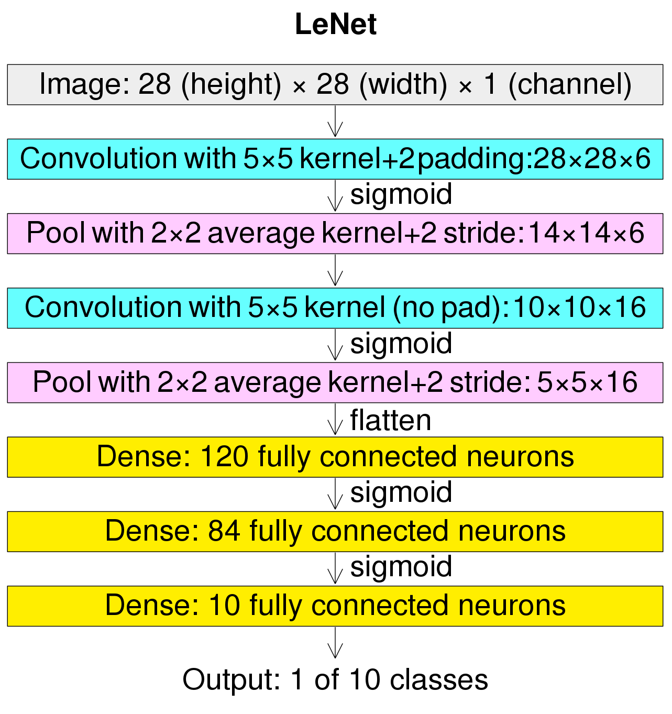

# LetNet 网络模型介绍

## 介绍

作为早期卷积神经网络的代表，LeNet拥有卷积神经网络的基本单元，如卷积层、池化层和全连接层，为卷积神经网络的未来发展奠定了基础。

## 特点

- 每个 卷积层 包括三个部分：卷积、池化和非线性 激活函数
- 使用卷积提取空间特征
- 二次采样平均池化层
- tanh 激活函数
- 使用 MLP 作为最后一个分类器
- 层间稀疏连接，降低计算复杂度

## 结构



如图（输入32*32像素的图像数据）：LeNet-5由七层组成。 除了输入之外，其他每一层都可以训练参数。图中，Cx代表卷积层，Sx代表子采样层，Fx代表完全连接层，x代表层索引。

C1层是一个 卷积层 ，有6个5x5的卷积核，特征映射大小为28x28，可以防止输入图像的信息掉出卷积核的边界。

S2 层是子采样/池化层，输出 6 个大小为 14x14 的特征图。 每个特征图中的每个单元都连接到 C1 中相应特征图中的 2x2 邻域。

C3层是一个卷积层，有16个5-5卷积核。 前六个 C3 特征图的输入是 S2 中三个特征图的每个连续子集，接下来六个特征图的输入来自四个连续子集的输入，接下来三个特征图的输入来自四个不连续的子集。 最后，最后一个特征图的输入来自 S2 的所有特征图。

S4 类似于 S2，大小为 2x2，输出 16 个 5x5 特征图。

C5 层是一个卷积层，有 120 个大小为 5x5 的卷积核。 每个单元都连接到 S4 的所有 16 个特征图上的 5x5 邻域。这里，由于 S4 的特征图大小也是 5x5，所以 C5 的输出大小是 1x1。所以S4和C5是完全连通的。 C5被标记为卷积层而不是全连接层，因为如果LeNet-5输入变大而其结构保持不变，其输出大小将大于1x1，即不是全连接层。

F6层与C5全连接，输出84个特征图。

## 示例代码

- 飞桨示例代码

```python
import paddle
import paddle.nn as nn
import paddle.nn.functional as F


# LeNet 网络模型
class LeNet(nn.Layer):
    def __init__(self, num_classes=10):
        super(LeNet, self).__init__()
        if num_classes < 1:
            raise Exception("分类数量 num_classes 必须大于 0: {}".format(num_classes))
        self.num_classes = num_classes
        self.conv1 = nn.Conv2D(
            in_channels=1, out_channels=6, kernel_size=5, stride=1)
        self.avg_pool1 = nn.AvgPool2D(kernel_size=2, stride=2)
        self.conv2 = nn.Conv2D(
            in_channels=6, out_channels=16, kernel_size=5, stride=1)
        self.avg_pool2 = nn.AvgPool2D(kernel_size=2, stride=2)
        self.conv3 = nn.Conv2D(
            in_channels=16, out_channels=120, kernel_size=4, stride=1)
        self.fc1 = nn.Linear(in_features=120, out_features=64)
        self.fc2 = nn.Linear(in_features=64, out_features=num_classes)

    def forward(self, x):
        x = self.conv1(x)
        x = F.relu(x)
        x = self.avg_pool1(x)
        x = self.conv2(x)
        x = F.relu(x)
        x = self.avg_pool2(x)
        x = self.conv3(x)
        x = F.relu(x)
        x = paddle.flatten(x, start_axis=1, stop_axis=-1)
        x = self.fc1(x)
        x = F.relu(x)
        x = self.fc2(x)
        return x
```
