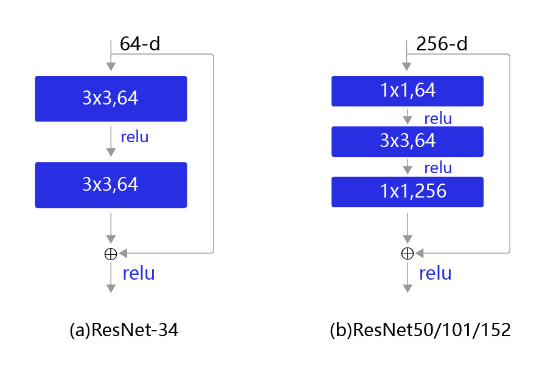
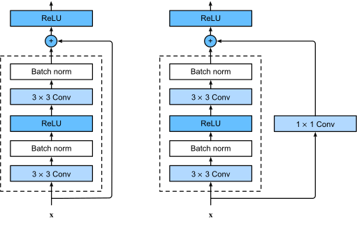

# ResNet 网络模型介绍

## 介绍

让我们先思考一个问题：对神经网络模型添加新的层，充分训练后的模型是否只可能更有效地降低训练误差？理论上，原模型解的空间只是新模型解的空间的子空间。也就是说，如果我们能将新添加的层训练成恒等映射f(x)=xf(x)=x，新模型和原模型将同样有效。由于新模型可能得出更优的解来拟合训练数据集，因此添加层似乎更容易降低训练误差。然而在实践中，添加过多的层后训练误差往往不降反升。即使利用批量归一化带来的数值稳定性使训练深层模型更加容易，该问题仍然存在。针对这一问题，何恺明等人提出了残差网络（ResNet） [1]。它在2015年的ImageNet图像识别挑战赛夺魁，并深刻影响了后来的深度神经网络的设计。

## 特点

让我们聚焦于神经网络局部。如图所示，设输入为xx。假设我们希望学出的理想映射为f(x)f(x)，从而作为图上方激活函数的输入。左图虚线框中的部分需要直接拟合出该映射f(x)f(x)，而右图虚线框中的部分则需要拟合出有关恒等映射的残差映射f(x)−xf(x)−x。残差映射在实际中往往更容易优化。以本节开头提到的恒等映射作为我们希望学出的理想映射f(x)f(x)。我们只需将图中右图虚线框内上方的加权运算（如仿射）的权重和偏差参数学成0，那么f(x)f(x)即为恒等映射。实际中，当理想映射f(x)f(x)极接近于恒等映射时，残差映射也易于捕捉恒等映射的细微波动。图右图也是ResNet的基础块，即残差块（residual block）。在残差块中，输入可通过跨层的数据线路更快地向前传播。


## 结构



现在很多网络结构都是一个命名+数字，比如（ResNet18），数字代表的是网络的深度，也就是说ResNet18 网络就是18层的吗？其实这里的18指定的是带有权重的 18层，包括卷积层和全连接层，不包括池化层和BN层。


下图表示出了ResNet-50的结构，一共包含49层卷积和1层全连接，所以被称为ResNet-50。


残差块有两个卷积层，输出通道数相同。 每个卷积层后面跟着一个批归一化层和一个 ReLU 激活函数。然后，我们跳过这两个卷积操作，直接在最终的 ReLU 激活函数之前添加输入。这种设计要求两个卷积层的输出必须与输入具有相同的形状，这样才能将它们相加。如果我们想改变通道的数量，我们需要引入一个额外的卷积层来将输入转换为加法操作所需的形状。



- 正如我们在表 3 中看到的那样，resnet 50 架构包含以下元素：

- 内核大小为 7 * 7 和 64 个不同内核的卷积都具有大小为 2 的步幅，为我们提供了 1 层。
- 接下来我们看到最大池化，步幅大小也为 2。
- 在下一个卷积中，有一个 1 * 1,64 的内核，然后是一个 3 * 3,64 的内核，最后是一个 1 * 1,256 的内核，这三层总共重复了 3 次，因此在这一步中我们有 9 层。
- 接下来我们看到 1 * 1,128 的内核，然后是 3 * 3,128 的内核，最后是 1 * 1,512 的内核，此步骤重复了 4 次，因此在此步骤中为我们提供了 12 层。
- 之后有一个 1 * 1,256 的内核和另外两个分别为 3 * 3,256 和 1 * 1,1024 的内核，重复 6 次，总共有 18 层。
- 然后又是一个 1 * 1,512 内核，其中有两个 3 * 3,512 和 1 * 1,2048，重复 3 次，总共有 9 层。
- 之后，我们做了一个平均池，并以一个包含 1000 个节点的全连接层结束它，最后是一个 softmax 函数，所以这给了我们 1 层。
- 我们实际上并没有计算激活函数和最大/平均池层。
- 总而言之，它给了我们一个 1 + 9 + 12 + 18 + 9 + 1 = 50 层的深度卷积网络。


## 示例代码

- 飞桨示例代码

```python
import paddle
import paddle.nn as nn
import paddle.nn.functional as F


class ResNetBlock(nn.Layer):
    """
    ResNetBlock 模块
    """

    def __init__(self, channels, stride=1, sample_stride=2, is_sample=False, is_simple=False):
        """
        ResNetBlock 模块

        Args:
            channels (list|tuple): 3个, 0输入通道, 1中间通道, 2输出通道
            stride (int, optional): 模块步幅，默认 1.
            sample_stride (int, optional): 采样模块步幅，默认 2
            is_sample (bool, optional): 是否采样模块，默认 False, 默认 不是采样模块
            is_simple (bool, optional): 是否简易模块，默认 False, 默认 不是简易模块
        """
        super(ResNetBlock, self).__init__()

        self.is_sample = is_sample  # 是否采样模块
        self.is_simple = is_simple  # 是否简易模块

        in_channels = channels[0]   # 输入通道
        mid_channels = channels[1]  # 中间通道
        out_channels = channels[2]  # 输出通道

        # 残差模块
        self.block = nn.Sequential()
        if (is_simple):
            # 简易模块
            self.block = nn.Sequential(
                nn.Conv2D(in_channels=in_channels, out_channels=mid_channels,
                          kernel_size=3, stride=stride, padding=1),
                nn.BatchNorm(num_channels=mid_channels),
                nn.ReLU(),
                nn.Conv2D(in_channels=mid_channels, out_channels=out_channels,
                          kernel_size=3, stride=1, padding=1),
                nn.BatchNorm(num_channels=out_channels)
            )
        else:
            # 正常模块
            self.block = nn.Sequential(
                nn.Conv2D(in_channels=in_channels, out_channels=mid_channels,
                          kernel_size=1, stride=1, padding=0),
                nn.BatchNorm(num_channels=mid_channels),
                nn.ReLU(),
                nn.Conv2D(in_channels=mid_channels, out_channels=mid_channels,
                          kernel_size=3, stride=stride, padding=1),
                nn.BatchNorm(num_channels=mid_channels),
                nn.ReLU(),
                nn.Conv2D(in_channels=mid_channels, out_channels=out_channels,
                          kernel_size=1, stride=1, padding=0),
                nn.BatchNorm(num_channels=out_channels)
            )

        if (is_sample):
            # 采样模块
            self.sample_block = nn.Sequential(
                nn.Conv2D(in_channels=in_channels, out_channels=out_channels,
                          kernel_size=1, stride=sample_stride, padding=0),
                nn.BatchNorm(num_channels=out_channels)
            )

    def forward(self, x):
        residual = x
        y = self.block(x)
        if (self.is_sample):
            residual = self.sample_block(x)
        x = paddle.add(x=residual, y=y)
        x = F.relu(x)
        return x


class ResNet(nn.Layer):
    """
    ResNet 网络模型

    输入图像大小为 224 x 224
    """

    def __init__(self, blocks, num_classes=10, is_simple=False):
        """
        ResNet 网络模型

        Args:
            blocks (list|tuple): 每模块数量
            num_classes (int, optional): 分类数量, 默认 10
            is_simple (bool, optional): 是否简易模块，默认 False, 默认 不是简易模块

        Raises:
            Exception: 分类数量 num_classes < 2
        """
        super(ResNet, self).__init__()
        if num_classes < 2:
            raise Exception(
                "分类数量 num_classes 必须大于等于 2: {}".format(num_classes))

        self.num_classes = num_classes  # 分类数量
        self.is_simple = is_simple  # 是否简易模块

        # 简易模块通道, [0输入通道, 1中间通道, 2输出通道]
        self.simple_channels = [[64, 64, 128],
                                [128, 128, 256],
                                [256, 256, 512],
                                [512, 512, 512]]

        # 正常模块通道, [0输入通道, 1中间通道, 2输出通道]
        self.base_channels = [[64, 64, 256],
                              [256, 128, 512],
                              [512, 256, 1024],
                              [1024, 512, 2048]]

        # 输入模块
        self.in_block = nn.Sequential(
            nn.Conv2D(in_channels=3, out_channels=64,
                      kernel_size=7, stride=2, padding=3),
            nn.BatchNorm(num_channels=64),
            nn.ReLU(),
            nn.MaxPool2D(kernel_size=3, stride=2, padding=1)
        )

        # 处理模块
        self.block = self.make_blocks(blocks)

        # 输出模块
        self.avg_pool = nn.AvgPool2D(kernel_size=7, stride=1)
        self.features = 512 if is_simple else 2048
        self.fc = nn.Linear(self.features, num_classes)

    def forward(self, x):
        x = self.in_block(x)
        x = self.block(x)
        x = self.avg_pool(x)
        # flatten 根据给定的 start_axis 和 stop_axis 将连续的维度展平
        x = paddle.flatten(x, start_axis=1, stop_axis=-1)
        x = self.fc(x)
        return x

    def make_blocks(self, blocks):
        """
        生成所有模块

        Args:
            blocks (list|tuple): 每模块数量

        Returns:
            paddle.nn.Sequential : 所有模块顺序连接
        """
        seq = []
        is_in_block = True
        for block_index in range(len(blocks)):
            is_first_block = True
            for i in range(blocks[block_index]):
                seq.append(self.make_one_block(block_index=block_index,
                                               is_in_block=is_in_block, is_first_block=is_first_block))
                is_first_block = False
            is_in_block = False
        return nn.Sequential(*seq)

    def make_one_block(self, block_index: int, is_in_block: bool, is_first_block: bool):
        """
        生成一个模块

        Args:
            block_index (int): 模块索引
            is_in_block (bool): 是否残差输入模块
            is_first_block (bool): 是否第一模块

        Returns:
            ResNetBlock: 残差模块
        """
        net = None
        stride = 1
        sample_stride = 2
        if is_in_block:
            stride = 1 if is_first_block else 1
            sample_stride = 1 if is_first_block else 2
        else:
            stride = 2 if is_first_block else 1
            sample_stride = 2
        channels1 = self.simple_channels[block_index] if self.is_simple else self.base_channels[block_index]
        if is_first_block:
            net = ResNetBlock(channels=channels1, stride=stride, sample_stride=sample_stride,
                              is_sample=is_first_block, is_simple=self.is_simple)
        else:
            channels2 = [channels1[2], channels1[1], channels1[2]]
            net = ResNetBlock(channels=channels2, stride=stride, sample_stride=sample_stride,
                              is_sample=is_first_block, is_simple=self.is_simple)
        return net


def get_resnet(num_classes: int, resnet=50):
    """
    获取 ResNet 网络模型

    Args:
        num_classes (int, optional): 分类数量
        resnet (int, optional): ResNet模型选项, 默认 50, 可选 18, 34, 50, 101, 152

    Returns:
        ResNet: ResNet 网络模型
    """
    if resnet not in [18, 34, 50, 101, 152]:
        raise Exception(
            "resnet 可选 18, 34, 50, 101, 152, 实际: {}".format(resnet))

    net = None
    if resnet == 18:
        net = ResNet([2, 2, 2, 2], num_classes, is_simple=True)
    elif resnet == 34:
        net = ResNet([3, 4, 6, 3], num_classes, is_simple=True)
    elif resnet == 50:
        net = ResNet([3, 4, 6, 3], num_classes, is_simple=False)
    elif resnet == 101:
        net = ResNet([3, 4, 23, 3], num_classes, is_simple=False)
    elif resnet == 152:
        net = ResNet([3, 8, 36, 3], num_classes, is_simple=False)

    return net
```
